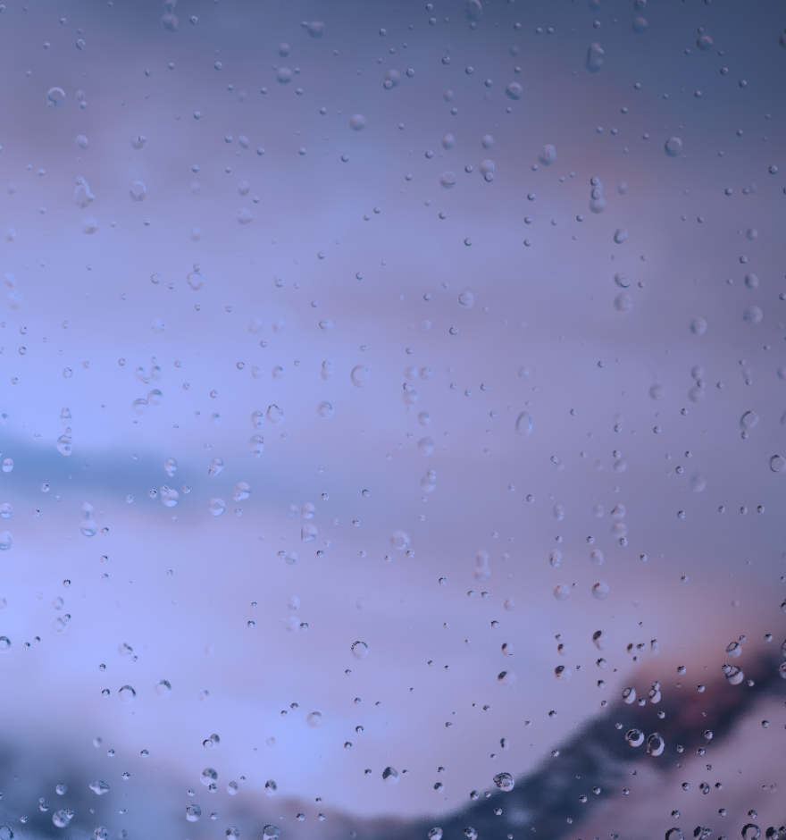

<div align="center">

# 🌧️ MistBoard

**A truly transparent desktop widget for Windows — it looks like it grows out of your wallpaper.**

Clock · Weather · Notes, sitting at the very bottom of the Z-order, naturally covered by app windows, blending into your wallpaper.


[Download](../../releases) · [中文说明](./README.md)



</div>

---

## ✨ Features

- **Truly transparent** — not a translucent black box; your wallpaper shows right through the widget
- **Lives on the desktop** — pinned to the bottom of the Z-order, so any app window naturally covers it; press Win+D to see it anytime
- **Gradient clock + day progress bar** — large gradient digits, a breathing colon, and a thin line showing how much of today has passed
- **Weather** — powered by Open-Meteo, auto-refresh every 30 min, manual city selection, offline cache with quick retry
- **Notes** — an always-open notepad with autosave
- **Position memory** — drag it anywhere; it comes back after restart
- **Featherweight** — a single ~4 MB exe, ~35 MB RAM

## 📦 Install

Download from [Releases](../../releases), or build from source:

```bash
# Prerequisites: Rust (MSVC), Node.js ≥ 18, WebView2
git clone https://github.com/your-username/MistBoard.git
cd MistBoard
npm install

npm run dev     # develop
npm run build   # output in src-tauri/target/release/
```

## 🔍 How it works

MistBoard is a **regular top-level transparent window** (Tauri 2 / WebView2) that stays at the bottom of the Z-order via `SetWindowPos(HWND_BOTTOM)` and re-sinks itself when it loses focus.

> War story: the classic Progman/WorkerW reparenting trick used by desktop widgets feeds a **mis-scaled copy of the wallpaper** into the transparent pixels on machines with DPI scaling ≠ 100%. MistBoard dropped that approach — that's why the transparency here is real.

## 📚 Data sources

- Weather: [Open-Meteo](https://open-meteo.com/) (free, no API key)
- IP geolocation: [ip-api.com](https://ip-api.com/) (only used for auto-locate when no city is set)

No analytics, no data collection. Notes and settings stay in local `%APPDATA%`.

## 📄 License

[MIT](./LICENSE) © 2026 MistBoard Contributors
